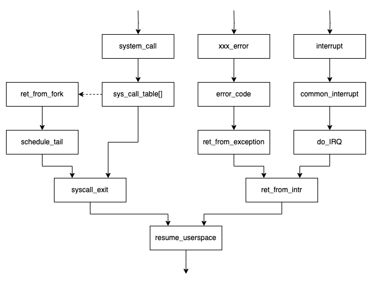
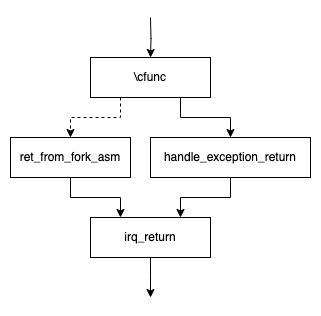
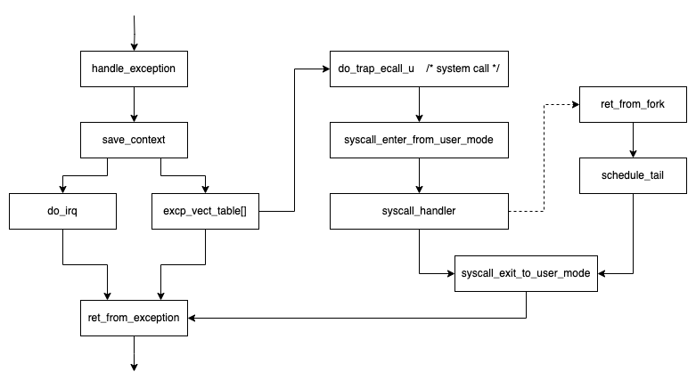

# Contents

[TOC]

# 1 Introduce

## 跨度大, 资料多, 术语的额外说明

#### Virtual Address and Virtual Memoey

本文中, Virtual Address指的是在processor’s addressable memory space ( [^03] Volume3 3.1 )中寻找寻址的地址。Virtual Memoey指的是processor’s addressable memory space这一空间。

在这一定义下, IA-32中Virtual Address是linear address。

关于这两个术语, 常见的参考资料中有以下观点:

- 在[^04] P200 和[^08]P153 中都认为不能独立转换为物理地址的抽象地址都被称为Virtual Address。这里的不能独立转换指的是需要段机制的参与[^WBL]。但无论是i386手册[^10], 还是IA-32手册[^03]都没有这样的定义。

- i386手册[^10]P15,  [^08]P89、P153 用Virtual Address Space / Virtual Memory来表达了内存管理系统的潜在能力。

  例如, i386手册认为"The processor can address up to four gigabytes of physical memory and 64 terabytes ($2^{46}$ bytes) of virtual memory."它的计算方法是, 段选择子(段选择符)中13位用于在GDT或LDT中索引一个段选描述符, 由TI位来具体选择使用GDT还是LDT, 同时每个段描述符又可以指向一个页表, 每个页表可以寻址4GiB的空间[^WBL]。所以有${2}\times{2^{13}\times{2^32}={2^{46}}}$ 的虚拟地址空间。这一计算方式甚至忽略了GDT的首个段描述符必须为空, LDT必须由GDT间接引用这些影响。是非常理想化的计算方式。

- 在https://foldoc.org/Virtual+address与https://foldoc.org/MMU中认为, 被MMU转化为物理地址/内存的地址被称为Virtual Address / Memory。且将MMU这一概念直接与PMMU划等号。片面的将由分页机制转化为物理地址的地址称为虚拟地址。

- 在[^08] P154中, 认为"Virtual Memory是指计算机呈现出要比实际拥有的内存大得多的内存量。"在IA-32手册中没有这样的定义的描述, 但[^03] Volume3 3.1中描绘了一种"能力", 即"Paging supports a “virtual memory” environment where a large linear address space is simulated with a small amount of physical memory (RAM and ROM) and some disk storage."。

  ~~在支持PSE-36的IA-32处理器中, 处理器实际能寻址的范围只有32bits, 而物理地址的寻址却能达到36bits。~~

在[^01]中, Linus先生并未指明Virtual Address和Virtual Memory的定义。现代Linux中非分页机制仅保证体系结构的要求[^WBL], 但由于本文要讨论使用了分段机制的早期Linux, 不对Virtual Address作出明确的定义会产生歧义。

#### 进程相关

The term “process” is often used with several different meanings([^05]P79). Task, Processes, Lightweight Processes, and Threads, etc这些术语在特定的语境下也有可能指的是“process”这一术语。

From the kernel’s point of view, the purpose of a process is to act as an entity to which system resources (CPU time, memory, etc.) are allocated([^05]P79).更简单的来说, 一个进程享有一个独特的Process Descriptor, 它是一个`struct task_sturct`的数据结构。(正是因为这个命名导致task和process在大部分情况下是同义词)

早期内核在创建一个新进程时, 子进程只能获得父亲进程拥有的资源的深拷贝( COW机制延后了深拷贝的时机, 但最终结果还是深拷贝 )。The multiple execution flows of a multithreaded application were created, handled, and scheduled entirely in User Mode([^05]P80).

后来, Linux使用了Lightweight Processes的概念来, 不同轻量进程依旧享有不同的进程描述符, 两个轻量级进程间可以共享一些资源。实现多线程程序时, 将轻量进程与每个线程关联起来。

但复杂的是, 现代Linux中, 存在大量与thread这一名词相关的数据结构。其中与进程相关的最重要的是`thread_info`。进程描述符中必然直接或间接包含一个`thread_info`结构, `thread_info`和`task_sturct`具体如何关联与体系结构相关。在某些体系结构中, `thread_info`结构是进程描述符的第一个成员。在这些结构中, 内核会用一个寄存器存放当前进程的 thread_info 结构体的地址，通过这个寄存器既可以得到 thread_info 结构体的地址，也可以得到进程描述符的地址([^07]P27)。

这让提前指明Task, Processes, Lightweight Processes, and Threads的定义变得不可能, 请读者注意。

#### 页表这一术语的歧义

Page table 一词会产生歧义。Page table这一术语可以指 a data structure used by a virtual memory system in a computer to store mappings between virtual addresses and physical addresses. 

在Linux术语中讨论Multilevel page table时, 为每一级页表结构进行了命名,  page table 又是其中的一级的名称。

在RISC-V特权级手册中, 并未给每一级结构命名, 而是都统称为page table。

为此我们额外引入两种额外的描述页表的方法。

两种方式都将虚拟地址从MSB到LSB分为三个主要部分: 符号扩展, 分级索引号, 页内偏移。

其中符号扩展部分可能不存在, 或者根据体系结构的不同会有不同的规定。

第一种方法, 受到了[^01]中的启发。[^01]中分级索引号被称为Index Level, 从L1开始, 由MSB至LSB方向逐级升高。假使当前为Index L$x$, 则我们称当前页表结构为第$x$级页表。例如, x86的页表目录, 在这种方式下被称为第一级页表

第二种方式, 出自[^07], 也是xv6-riscv在编码中使用的描述方式。分级索引号被称为VPN ([^WBL] RV页表术语说法), 从VPN[0]开始, 由LSB至MSB方向逐级升高。这种描述方法一般会出现在本文的代码实现中。

本文涵盖了Linux不同的发展时期的资料, 对于页表的描述时可能会出现的歧义, 将在这三种描述方式选择合适的进行说明以避免歧义

# 2 体系结构相关

~~本文将体系结构相关的部分分为四个重点: Memory Layout、Entry Path and Exit Path、Context Switch和Kernel and Process Initialization。~~

... 

## Comparing the ISAs of RISC-V and x86

### Modular vs. Incremental ISAs (模块化ISA和增量型ISA)

x86是一种增量型ISA, RISC-V是一种模块化ISA. [^11]中比较了他们的优劣, 本文仅讨论两种ISA的同异之处。

RISC-V的ISA由一个base ISA (RV32I or RV64I)和各种optional standard extensions组成。The convention is to append the extension letters to the name to indicate which are included. For example, RV32IMFD adds the multiply (RV32M), single-precision floating point (RV32F), and double-precision floating point extensions (RV32D) to the mandatory base instructions (RV32I).

字母G有着特殊的含义, 它并不单指某一种可选的扩展, 而是用于标记“general-purpose”的ISA。它包含了a combination of a base ISA (RV32I or RV64I) plus selected standard extensions (IMAFD, Zicsr, Zifencei)。( Zicsr, Zifencei来自RISC-V的另一种扩展命名方式, 具体请参考 [^15] ISA Extension Naming Conventions )

Some ISA extensions depend on the presence of other extensions, e.g., “D” depends on “F” and “F” depends on “Zicsr”. These dependences may be implicit in the ISA name: for example, RV32IF is equivalent to RV32IFZicsr, and RV32ID is equivalent to RV32IFD and RV32IFDZicsr.

本文主要的移植目标就是RV64G。

x86作为一种增量型ISA, 从8086发展至今, 最近于2023年提出x86s ISA以简化其指令集[^16]。正如[^11]所说, x86架构有着“沉重的历史包袱”, 这可以从( [^WBL]  有关启动部分 16-bit...)看出, 但是有些时候我们可以借用x86的前辈处理器的思想简化我们的研究( [^WBL] 用8086解释段结构)。本文主要的讨论的是80386 (i386)处理器。早期Linux中实际上提及了80486处理器与80387数学协处理器芯片, 但我们不会过多讨论 ( [^WBL] 数学处理器部分)。

### Privilege Levels

x86的保护模式的权级从 Level 0 至 Level3 权限逐级降低([^03] Volume3  2.5 、5.5)。由于intel在手册中用使用了protection rings的概念, 一些文献也将其称为4层Ring, 标号规则与前面所述的一致。本文仅讨论用于内核态的 Level 0 与用于用户态的 Level3 。

> The processor’s segment-protection mechanism recognizes 4 privilege levels, numbered from 0 to 3. The greater numbers mean lesser privileges.

RISC-V的权级从 Level 0 (level of 0) 至 Level3 权限逐级升高([^09])。虽然设计了4个权级, 但权级为3的M模式是唯一一个所有标准 RISC-V 处理器都必须实现的特权模式。

在RISC-V的设想中, 实现不同数量的权级能实现不同的作用。

| Number of levels | Supported Modes   | Intended Usage                              |
| ---------------- | ----------------- | ------------------------------------------- |
| 1                | M                 | Simple embedded systems                     |
| 2                | M, U              | Secure embedded systems, RTOS               |
| 3                | M, S, U           | Systems running Unix-like operating systems |
| 4                | M, HS, VS, VU / U | Support Type-2 hypervisor execution         |

不同权级模式Abbreviation和对应的Level与名称之间的关系。

| Level | Encoding | Name                           | Abbreviation |
| ----- | -------- | ------------------------------ | ------------ |
| 0     | 00       | User/Application               | U            |
| 0     | 00       | Virtualized User               | VU           |
| 1     | 01       | Supervisor                     | S            |
| 1     | 01       | Virtualized Supervisor         | VS           |
| 2     | 10       | Hypervisor-Extended Supervisor | HS           |
| 3     | 11       | Machine                        | M            |

在RISC-V中, 内核并不运行在最高权级中。这与x86不同, 运行在RISC-V非最高权级的内核并不能拥有最高权限。包括访问CPU的编号与属性、响应定时器中断、核间通讯(IPI)、异常处理等都不能直接处理。而是依赖于The higher privilege software providing SBI (Supervisor Binary Interface) interface.例如在M、S、U情况下, 运行在M-mode的SBI为S-mode的操作系统提供接口。在使用Hypervisor Extension的情况下, 运行在M态的SBI为HS态的OS or hypervisor提供接口.An HS-mode hypervisor is expected to implement the SBI for its VS-mode guest.

> 曾经的设想中, 为HS提供接口的被称为HBI, 为VS和S提供接口的被称为SBI。但当下术语中, 无论是为HS、VS还是S提供的接口都称为SBI。

SBI可以被认为是一种runtime, 也可以被更简单的认为是一种固件, 如QEMU甚至直接称其为BIOS。

本文仅讨论使用M、S、U三种权级的情况。大多数情况下, 我们会忽略M态和SBI的存在。但在[^WBL]异常处理等章节, 我们会设计到一些SBI的实现, 这有助于我们理解。

### 通用寄存器

x86的寄存器分为3类([^13] 2.3 P29): General registers, Segment registers, Status and instruction registers.其中通用寄存器有8个, 分别为EAX, EBX, ECX, EDX, EBP, ESP, ESI, and EDI。其中instruction registers是instruction pointer register(EIP), the low-order 16 bits of EIP is named IP.而IP is analogous to the program counter (PC) ([^13] P2-7).

本文将RV32I / RV64I这样的Base ISA的从x0到x31寄存器称为RISC-V的通用寄存器 。其中与ARM(32位)架构将R15通用寄存器用于存储PC不同, RISC-V并不将PC寄存器归为通用寄存器, 也不直接将PC暴露给编程者。此外, 使用Control and Status Register (CSR)需要Zicsr扩展。

x86设计者和RISC-V设计者对“通用寄存器”这一术语的理解显然是不同的。x86的设计者认为, general-purpose registers are used primarily to contain operands for arithmetic and logical operations.RISC-V设计者认为的通用寄存器是不存在在某条指令中一定需要某个通用寄存器参与。

从RISC-V设计者的角度来看, x86的8个通用寄存器并不“通用”。x86中的一些通用寄存器是一些指令中有特殊用途的, 例如eax是默认的累加寄存器, ecx用于循环计数等等。事实上, 如果我们追溯i386的历史, 也就是8086会发现, 所有x86的8个通用寄存器在8086中的前身每一个都有特殊的用途。也正因如此, 从ISA的角度, x86的8个通用寄存器都有自己的名字: A for Accumulator, B for Base, C for Count, D for Data, SP for Stack Pointer, BP for Base Pointer, SI for Source Index, DI for Destination Index.

RISC-V将x0寄存器硬连线为0, 当这不仅没有破坏RISC-V寄存器设计的通用性, 反而有所加强。由于 ARM-32 和 x86-32 没 有零寄存器，它们需要通过原生指令实现这些操作。但对于 RISC-V，只需简单地将零寄存器作为其中一个操作数，即可通过 RV32I 指令实现相同操作( [^11cn] P18、P35)。例如: `nop`在RISC-V中的实现为`addi x0, x0, 0`。 再例如`jr rs1` (Jump Register)被实现为`jalr x0, 0(rs1)`, `jalr`会记录转跳的返回位置也就是当前指令的下一条指令, 但由于`jr`不需要记录, 所以将其丢入硬连线为0的x0中。

RISC-V的汇编器通过提供伪指令的形式为汇编语言程序员或编译器开发者提供便利。例如[^WBL]下一节即将提到的`ret`就是一条伪指令, 汇编器将其替换为 `jalr x0, x1, 0`。即, 将下一条指令送入x0寄存器中保存, 将x1寄存器中的值加上符号扩展的offset 0之后送入x1寄存器。请注意区别x86等架构实现的一条"指令"与RISC-V汇编器层面的“pseudoinstruction”的区别——前者是"instruction", 后者是"mnemonic"或更接近一种宏。

### ABI and Calling Conventions

~~操作系统中包含了许多需要使用汇编语言为高级语言( 主要是C语言 )准备运行环境( runtime )、保护上下文、以及汇编与高级语言的配合。这就需要了解ABI和调用规范。~~

~~不同ISA的设计思想会影响ABI和调用规范的设计, 而ABI和调用规范的设计又会影响内核数据结构上的设计。~~

~~IA-32有很多调用规范, 其中Linux内核主要使用的是cdecl调用规范。~~

操作系统中存在使用非编译器生成的汇编语言调用C语言函数和在C语言函数中调用非编译器生成的汇编语言的部分。这涉及到ISA的ABI和调用规范。

x86的调用规范有许多版本, 这与操作系统、所使用的高级语言等等各种因素息息相关。与Linux内核关联紧密的是cdecl调用规范, 它是GCC编译器默认的调用规范。而RISC-V的调用规范从设计之初就与Unix和GCC紧密相连, 它的版本暂时比较唯一。

内核中不同调用规范之间的差异有许多, 在研究内核时需要注意的有以下几点:

第一是参数和返回值的传递方式。

从宏观的来看, 早期的Linux x86-32的cdecl调用规范在传值的时候主要使用栈, x86-64和RISC-V指令集则更偏向于使用寄存器来传递参数。一开始Linux内核对于x86-32架构严格使用cdecl调用规范。但随着内核的发展, 对于x86-32架构开始使用x86-32下GCC中的特殊属性`__attribute__((regparm(n)))`来解决不同情况下的寄存器传值问题, 其中, n代表用于传值的。此变化可以从对应的linkage.h头文件中看出。需要额外说明的是, 在Linux 2.6中的一段时间, IA-32曾引入名为fastcall的宏, 其本质就是`__attribute__((regparm(3)))`。请区别这个宏名与名为fastcall的调用规范之间的区别。

有些参考文献如[^08]认为使用栈来传值意味着callee能拥有更多比实际caller传递过来的参数。[^08]中的举例Linux 0.12中的`_sysfork()`函数, 它自身认为自己有18个参数, 而距离它较近的汇编函数在调用它前后仅压入和弹出了5个参数。但本文认为这仅仅是利用cdecl下用于传参的栈由caller cleanup( 或称“由caller负责栈平衡操作” )的一种技巧。

第二是各个寄存器在调用函数时的作用。

展开来说涉及到寄存器在调用前后是否一致, 或者说某个寄存器是callee-save还是caller-save。以及ABI别名。

首先讨论ABI别名。在通用寄存器一节提到了x86主要的8个通用寄存器的命名本质上来自8086时期的寄存器的作用。而对于RISC-V的通用寄存器来说, 他们的别名则全部来自ABI与调用规范。RISC-V的ABI别名分别是: zero for hard-wired zero, ra for Return Address, SP for Stack Pointer, GP for Global Pointer, TP for Thread Pointer。剩下的寄存器分为Temporaries、Saved register和Functions arguments.其中s0同时兼顾frame pointer, 所以也能表示为fp, a0和a1兼顾return values.如果按RISC-V通用寄存器原始顺序来看, 剩下的三大类寄存器交错出现, 这是因为RISC-V设计了一种使用更少寄存器的方案, 在此本文不过多赘述。

其中zero, gp, tp 和 fp需要额外说明。

首先, 是fp寄存器, RISC-V不强求使用fp去维护函数调用栈, 但是fp指针和sp指针配合对unwind是有作用的。也是处于s0/fp有可能作为栈指针被使用, U-Boot启动时在保存由a1传入的参数时, 没有保存在s0中, 而是保存在s1中。

zero, gp, tp即不由caller维护也不由callee维护。zero由于硬布线零不需要维护。 gp作为链接器松弛的作用, 它的加载需要特殊操作[^TBF]==毕设这块直接省略==。tp指针在设计上被用于TLS (Thread-Local Storage), 这体现在RISC-V的测试用例中( https://github.com/riscv-software-src/riscv-tests/blob/master/benchmarks/common/crt.S#L119 )。但是在实践中, tp寄存器往往直接或间接指向当前的HART ID( ==RISC-V术语, 毕设此处省略== )。

tp储存hartid——xv6-riscv

tp间接储存hartid —— openSBI	tp指向sbi_scratch

https://github.com/riscv-software-src/opensbi/blob/d4d2582eef7aac442076f955e4024403f8ff3d96/include/sbi/sbi_scratch.h

tp间接储存hartid —— Linux	tp指向thread_info, 其中cpu间接映射到hartid

## Memory Layout

> 相关名词搭配:
>
> - ( Virtual or Physical ) Memory Layout	见2.1.1标题来源
> - ( Virtual or Physical ) Address Space	见[^01]和2.1.5标题来源
> - Virtual Address, Physical Address		见[^01]
> - kernel memory, user memory		见2.1.5标题来源
> - memory management				见[^01]
>
> 
>
> 特别注意:
>
> - VMA ( Virtual Memory Area ) 一般特别用于描述https://www.oreilly.com/library/view/linux-device-drivers/9781785280009/4759692f-43fb-4066-86b2-76a90f0707a2.xhtml
> - VAS ( Virtual address space ) wiki: https://en.wikipedia.org/wiki/Virtual_address_space
>   - 某些情况下仅指user的部分, 例如https://www.ibm.com/docs/en/zos-basic-skills?topic=storage-what-is-address-space
>   - 微软的手册认为VAS中应分为两个部分 https://learn.microsoft.com/en-us/windows/win32/memory/virtual-address-space

Memory Layout 问题可以被分为 Virtual Memory Layout 和 Physical Memory Layout 两个子问题。自然地, 我们会讨论将Virtual Address 映射到 Physical Address的方法([^01]P25)。需要注意的是, 现代的Linux已经支持不使用MMU[^TBC], 但是我们将不讨论这种情况。

在讨论 Virtual Memory Layout 问题时, 我们会讨论到 kernel memory 与 user memory 的划分(split)问题。这其中会涉及到权级相关问题。

### Virtual Memory Layout on 现代 Linux

> - 标题名命名来自https://docs.kernel.org/arch/riscv/vm-layout.html 《Virtual Memory Layout on RISC-V Linux》

总的来说, 现代Linux中, 拥有内核态权限的内存位于虚拟地址的高位, 而用户态权限

从布局上看, kernel memory在高地址user memory在低地址, 参考[^05cn]P73。[^07]P121。或Linux网页手册。

且仅使用页表/类页表结构。[^01]说明在几种架构采用的类分页机制的几种例子。

| 架构    | 映射方法                                                 |
| ------- | -------------------------------------------------------- |
| 80x86   | page table(段机制仅满足体系要求)                         |
| Alpha   | page table                                               |
| PowerPC | hash table                                               |
| MIPS    | not have any architecture-specified page tables, BUT TLB |

在此我们讲问题简化为仅讨论页表机制。

- 现代Linux分页机制

  Linux 0.01~1.0的时代, x86-32手册的术语来说, 整个分页机制分为页表目录、页表、页内偏移三个部分, 被视为一个2级页表。

  在[^01] P28中引入了kernel virtual page tables的概念。并使用了三级的页表, 分别为Page Directory、Mid Page Table、Page Table、 Offset in Page  ( [^01] P27 )。如果实际的硬件体系结构的页表级数少于3级, 则会通过机制隐藏其中的一级。

  Linux 2.6中, 内核使用的虚拟页表是一个4级页表[^06] P124~P125。

  Linux 4.11时, 页表被扩展为5级[^07] P219。

  正如[^01] P28中所说:

  > As three levels is enough to map on the order of 40–45 bits of virtual address space, and no current hardware supports more, that was the choice for the Linux kernel virtual machine.

  每一个级数的设计在当时的眼光看都是足够的。但从级数的不断增长来看, 似乎随着技术的发展, 一切都不会**足够**。

  本文在叙述时并未为每一级页表命名, 只是简单的至顶而下成为第?级目录。

  

  

  

- RV中页表相关术语

  RV特权级手册中, 仅使用了page table 与page table entrie (PTE)来描述页表这一数据结构。RV32中每page table consist of $2^{10}$ PTEs, RV64中每page table consist of $2^{9}$ PTEs。每一PTE存储的下一级的映射信息每一份页表仅使用了最高级(被放入`satp`寄存器的)的页表被称为root page table。

  

- 使用页表表项的权级区分U与S

  见[^05cn] P76

- 用(总)页表来区分不同进程(线程)的地址空间

  见[^05cn] P73。同时在部分设计中, 两个不同的进程描述符通过共享一份(总)页表的引用来达到某种资源共享的目的。这一点从Linux 1.00中开始, 之后的资源共享机制变得复杂, 

### Segmentation and Paging in 现代 x86 Linux

> - 标题命名来自[^05]第二章的两个小节标题

简言之, 现代x86-32中, 页表为主, 默认情况下段结构仅用于满足体系结构要求。依旧保留段机制的原因是, 分段在x86体系结构中是必须的。见 [^03] Volume3 3.1。

x86有三种地址相关的术语: 逻辑地址、线性地址与物理地址。他们的关系是: 线性地址 -分段-> 逻辑地址 -分页-> 物理地址。

段机制来自8086, 在8086中, 仅仅是将段寄存器的值乘16(左移4位)然后加上对应的寄存器使用。i386中引入了GDT和LDT间接引用。

现代Linux中段机制所起的作用非常有限, 在设计时会保证线性地址与逻辑地址实际上一致。一方面许多其它的体系结构没有段机制, 他们更经常使用类页表机制。另一方面, x86-32和x86-64代码的合并也是一个原因。尽管x86-64中段机制也是必须开启的, 但是段必须以0为起点[^04]P229。

现代Linux的段机制仅保留了每个CPU一个GDT和一个默认的LDT( [^05cn] P50 ), 在必要的系统调用时才会临时增加LDT。这样的设计第一次出现是在Linux 1.00中。从Linux 1.00开始, 默认情况下, Linux 1.00中所有进程私有的LDT表项都指向`&default_ldt`, 只有在首次调用`sys_modify_ldt`的`write_ldt`操作时, 会分配一个新的空间来存放一个新的LDT表。( 注: 子进程fork拥有非默认LDT的父进程时, 对LDT的复制采取的是重新分配空间的深拷贝 )。

现代Linux中, 每个CPU对应的GDT中用户代码段、用户数据段、内核代码段、内核代码段的Base都为0x0, 长度都为4GiB。Linux 1.00在对GDT的设置上与现代Linux有些不同, 我们在后面接介绍[^WBL]。

现在Linux使用段机制仅为了满足x86体系结构的要求。既不会使用段机制来隔离不同的进程的地址空间, 也不使用段机制来隔离用户态与内核态的地址空间。这些都由分页机制管理。分页机制的使用正如上一小节所说, 使用页表表项的权级区分U与S, 用(总)页表来区分不同进程(线程)的地址空间。

### Segmentation and Paging in 早期 Linux

正如Linus在[^01]中所说, “Linux did not even try to avoid using the x86 features available to those early versions”. 段机制作为x86, 尤其是x86-32的硬件内存管理特色, 在早期的Linux中起关键作用。这个时期的Linux对其它架构的可移植性很弱, 它们仅适用于x86-32体系结构。

我们以Linux 0.01~1.00中的几个版本作为分析对象。

#### 段机制

在介绍这个时期Linux的段机制时, 我们必须从线性地址和逻辑地址两种视角来说明问题。~~此外Linux 0.01~0.99中的0号进程和1号进程的长度都是640KiB, 为了简洁性, 后面的介绍中我们不会特别提及这一点。~~

从线性地址地址角度来看, 由于分段机制, 无论是出于用户态的地址空间还是内核态的地址空间都是从0开始的。由于分段机制仅影响了对应线性地址和逻辑地址的起始点(base 地址), 所以他们的限长是统一的。

从逻辑地址的视角看, 内核地址空间与用户态地址空间的起点与范围的问题, 可划分为几个阶段。
$$
\text{Kernel Version}\begin{cases}

  \text{用户态进程默认使用GDT}\begin{cases}
  \text{Linux 1.00}\\
  \end{cases}\\
  
  \\

  \text{用户态进程默认使用LDT}\begin{cases}

    \text{使用页机制隔离不同进程}\begin{cases}
    \text{Linux 0.99}\\
    \text{Linux 0.98.6}\\
    \text{Linux 0.98}\\
    \text{Linux 0.97.6}\\
    \end{cases}\\
    
    \\

    \text{使用段机制隔离不同进程}\begin{cases}
    
      \text{代码段和数据段长度相等}\begin{cases}
      \text{Linux 0.97}\\
      \text{Linux 0.96c}\\
      \text{Linux 0.95}\\
      \text{Linux 0.12}\\
      \end{cases}\\
      
      \\
    
    	\text{代码段和数据段长度不等}\begin{cases}
      \text{Linux 0.11}\\
      \text{Linux 0.10}\\
      \text{Linux 0.01}\\
      \end{cases}\\

    \end{cases}\\

  \end{cases}\\

\end{cases}\\
$$
Linux 1.00开始用户态进程代码段和数据段默认开始使用GDT选择子, 而非之前版本所使用的LDT选择子。这体现在用户态进程(实际)使用的段选择子上。( `INIT_TASK`宏中装在的段选择子并不是最后实际使用的段选择子, 这点体现在``move_to_user_mode()``宏中 ) ( Linux 1.00中存在很多与LDT相关的代码, 这点我们在后面在做说明 )

在默认使用LDT作为用户态选择子的版本中, 用户态进程起点与范围集中体现在 `INIT_TASK`宏、fork系统调用和exec系统调用的相关代码上。

在这其中, 有三项等价的特征可以用于划分。分别是: 以用户态进程的起点是否与nr无关为划分、以用户态是否拥有3GiB的段长度为划分、以用户态拥是否拥有私有的(总)页表(即页表目录)为划分。这一变化出现在Linux 0.97与Linux0.97.6之间。在Linux 0.97.6及之后的版本, 用户态的段机制便都以0x0为起点, 段长为3GiB, 也因此每个进程都需要自己的私有页表。在Linux 0.97及之前的版本中, 段起点与nr号相关, nr*0x400_0000。(nr为)0号进程的段长为640KiB, 所有fork于它的子进程的段长在由exec系统调用更改前均继承于(nr为)0号进程的长度。而在执行exec时则将代码段和数据段设置成对应的长度。

而exec中为修改的新段limit中, 可以从code_limit和data_limit是否相等来做进一步细节上的区分: 0.01~0.97中数据段的长度都为64MiB, 而代码段的长度设置上却有些区别。0.01、0.10和0.11中, 代码段的长度来由`change_ldt` 函数中的 `text_size`参数决定; 在此之后(直至0.99), 都是直接在`change_ldt`中令code_limit = data_limit = TASK_SIZE(只是TASK_SIZE宏的数值有区别, 如同前文所述, 0.97及之前为64MiB, 0.97.6及之后为3GiB)。(此期间`change_ldt` 函数保留了 `text_size`参数, 但是实际上并未在函数内使用这个参数)

`change_ldt`存在于我们所列出的所有早期版本中。但是在Linux 1.00中`change_ldt`彻底脱离了重设用户态进程LDT的用途, 且与之前提到的从Linux 1.00中开始支持的`sys_modify_ldt`的实现无关。

#### 页机制

用户态进程与(总)页表的关系主要通过`invalidate()`宏和fork中的系统调用中的`copy_page_tables`体现。

页表的使用因是否使用段机制分离用户态进程而划分。

Linux 0.01~0.97使用段机制分隔不同进程, 整个Linux内核与进程公用一份一级页表。此时`invalidate()`宏仅是将0重新写入CR3寄存器来完成页表的刷新(一级位于0x0处)。`copy_page_tables`本质上是对二级页表的复制。

Linux 0.97.6~1.00使用页表来隔离不同的进程, 设计上一个进程私有一份一级页表。此时`invalidate()`宏会通过将CR3读出再写入的方式完成对页表的刷新。`copy_page_tables`会为每个进程的一级页表和二级页表重新分配空间, 完成页表的深拷贝。

在使用页表来隔离不同的进程的版本中, Linux 1.00又是一个特例。它不仅提供了`copy_page_tables`还提供了`clone_page_tables`这个函数。`clone_page_tables`仅将子进程的一级页表指向父进程的一级页表, 并未重新分配空间。

子进程的页表是父进程页表的一份引用。此时内核对于“进程”的描述还停留在process (例: `copy_process`)与task一词。如果从现代角度回看, 我们不难看出其行为与“线程”的关系。尽管此时的clone机制仍是相当简陋的。

#### 段机制与分页机制的相互制约

早期Linux中段机制与分页机制的相互作用制约了所能安装的物理内存大小。Linux 0.97.6及以前, 物理内存的大小与head.S中的页表设置和GDT设置相关。Linux 0.98中物理内存的大小与head.S中的页表设置相关。而到了Linux 0.98.6中, 物理内存大小才与head.S中的设置解耦。

Linux 0.01 ~ Linux 0.97理论上只能安装最大64MiB的内存。

在GDT的内核范围设计上默认为16MiB, 在页表可能冲突的层面上最大可以接受64MiB的范围。由`TASK_SIZE`所影响。Linux早期将`TASK_SIZE`设为64。(4GiB / TASK_SIZE = 64MiB ) 同时仅有一份(总)页表, 前端的内存空间只能由一级页表的前端做恒等映射。这一段虚拟地址并不能跟task1的段虚拟地址冲突。

Linux 0.97.6 ~ 1.00期间, 开发者希望用户态进程能拥有更大的用户态地址空间, 且能支持安装了更大物理内存的机器。但是开发者们关注的仍然是16MiB、32MiB这种级别的物理内存大小的问题。换言之, 早期的内核没有考虑到拥有和GDT限长相等的安装1GiB物理内存的情况。现代Linux能处理好这一点, [^WBL]。

### Physical Memory Layout

#### x86的物理内存

处于兼容性考虑, 物理地址0x000a0000到0x000FFFFF (640KiB~1MiB)处留给BIOS以及一些图形卡[^05cn]P71。

Linux 0.01~ Linux 0.99中, 内核实际被放置在物理地址0x0~640KiB区间中。

Linux 1.00中内核如果不使用压缩启动模式, 内核将被加载到0x00001000处。使用compressed boot则会被放置到0x00101000处。(见head.S)

这是因为Linux 0.01 ~ Linux 1.00的一级页表(Linux 0.01 ~ 0.97为全局一级页表`_pg_dir`, Linux 0.97.6 ~ 1.00为临时一级页表`_swapper_pg_dir`)都是紧挨内核头部放置的, 内核最前端代码将在执行完后被页表数据覆盖。Linux为了保证内核的NULL异常也能被捕获, 所以让第一个页不存在。

> .org加载的位置是LD时推断的位置, 与entry入口的位置无关。
>
> 如果一段代码在链接的时候用了 -Ttext 1000 参数, 然后这段实际被加载到了0x00101000。
> 紧跟在.org 0x1000汇编后的符号会被加载到0x00101000。因为这个符号认为自己处在0x1000 ( 也就是与指定的入口是同一个位置 )。因为加载时整体偏移了0x00100000, 所以实际位于0x00101000。

由于Linux 1.00的代码本身还是以0x1000为起点, 本文中我们仅在这一篇章提及这1MiB的偏移。

Linux 2.6中, 内核被加载到了物理地址的0x00100000处。此时不再需要保留0x1000( 第一个页 )来捕获内核访问NULL指针的异常。此时系统的内核态和用户态用页表权限的方式分离, 保留0x0开始的第一个页的工作留给了用户态的内存布局来实现。

#### RISC-V的物理内存

当下RV会把M-mode的runtime, 即SBI放在物理的内存开头处。Linux RV的启动手册要求内核被放置在与PMD (Page Middle Directory, 页中间目录)的边界上(rv64就是2MiB, rv32是4MiB)。当下SBI runtime的大小往往远小于2MiB。Linux内核代码( head.S )则更直接, 如果是rv64就偏移2MiB, 如果是rv32就偏移4MiB ( PS: 在M-mode下内核不偏移 )。

另外, 使用SBI的话, a1有可能包含设备树在内存中的位置( 之后补充严谨 )。

### Virtual Memory Split

> - 标题名来自https://git.kernel.org/pub/scm/linux/kernel/git/torvalds/linux.git/tree/arch/x86/Kconfig#n1434  `prompt "Memory split" if EXPERT`

总的来说, 虚拟内存的划分有两种情况。部分体系结构要求的虚拟地址位宽会小于最大寻址的位宽, 它们之间的差距要求以虚拟地址位宽的最高位进行符号扩张, 这会在虚拟地址空间中制造出一个无法合法寻址的空洞区。如果虚拟内存空间中没有空洞, 系统会手动划分。如果虚拟内存空间中有空洞, 则自然的以由空洞分割的两个子空间来划分。

前者的例子是x86-32。它使用`CONFIG_PAGE_OFFSET`来在虚拟内存划分内核态和用户态。[^06]中P145给出了不用划分比例的情况。

x86-64, AArch64, RV64则都符合后者的情况。[^04]P227, [^07]P115分别介绍了x86-64和AArch64的情况。

## Entry Path and Exit Path

### 中断与异常分类

#### x86-32中的中断与异常分类

i386手册规定, There are two sources for external interrupts and two sources for exceptions:
$$
\text{Interrupts}\begin{cases}
\text{Maskable interrupts}\\
\text{Nonmaskable interrupts (NMI)}\\
\end{cases}\\

\\

\text{Exceptions}\begin{cases}
  \text{Processor detected}\begin{cases}
  \text{faults}\\
  \text{traps}\\
  \text{aborts}\\
  \end{cases}\\
  
  \\
  
  \text{Programmed}\begin{cases}
  \text{INTO}\\
  \text{INT 3}\\
  \text{INT n}\\
  \text{BOUND}\\
  \end{cases}\\
\end{cases}\\
$$
其中, INTO, INT 3, INT n, and BOUND这些指令被称为"software interrupts", 但是它们被视为异常来处理。

其中, fault发生时, 会记录引发fault的指令。trap发生时, 会记录指令流中的下一步指令, 例如如果trap发生在jmp, 会记录jmp所转跳的地址, 而不是紧接在jmp后面的指令的地址。

#### RISC-V中的中断与异常分类

RISC-V特权手册规定, 中断和异常都被统称为trap。
$$
\text{Traps}\begin{cases}
  \text{Interrupts}\begin{cases}
  \text{Software interrupt}\\
  \text{Timer interrupt}\\
  \text{External interrupt}\\
  \text{CLIC相关 (Drafting)}\\
  \end{cases}\\

  \\

  \text{Exceptions}\begin{cases}
    \text{Processor detected}\\

    \\

    \text{Programmed}\begin{cases}
    \text{ecall}\\
    \text{ebreak}\\
    \end{cases}\\
  \end{cases}\\
\end{cases}\\
$$
有关CLIC相关的规范正在制定中, 本文并不对齐进行讨论。

其中的Software interrupt对应的是x86或Linux中核间中断的概念(IPI)。

RISC-V仅会记录发生trap时pc的值。但由于RISC-V在非压缩指令集下指令长都为32位, 所以可以用pc+4软件的处理这个问题。压缩指令集下指令长为16位, 本文不讨论这种情况。

### 中断与异常相关的硬件结构

#### x86中的中断与异常的硬件结构

在x86中, 与中断与异常处理关系最紧密的结构是IDT。在x86-32中IDT可以存在三种类型的门描述符、中断门（Interrupt gate）描述符、陷阱门（Trap gate）描述符、任务门（Task gate）描述符。x86-64中已经不在支持任务门描述符, 在IDT中仅能存放中断门描述符、陷阱门描述符。

任务门被设计为用于和TSS配合以完成任务切换。Linux仅用它来处理x86-32中的双重错误。

中断门和陷阱门的差异在于, 当处理器穿过中断门时, 会关闭中断, 而穿过陷阱门时则不会。在初始化这两种门的时候需要设置其中的DPL位。只有利用INT n, INT 3 或 INTO指令产生指令时才会检查当前权级与DPL的关系。这是为了防止用户通过这些指令来模拟非法的中断或异常。如果我们希望用户能发出一个编程异常, 需要将对应中断门或陷阱门描述符的DPL设置为3(也就是x86中用户态全级)。否则, DPL应该被设置为0。

x86-64中, 中断门和陷阱门引入了IST位, 它可以无条件的进行栈的切换[^WBL]。

x86中中断指向一个中断向量表, 当发生对应中断时, 会转跳到对应地址去执行。

#### x86 Linux中有关门的术语

| Linux中有关门的术语  | 实际使用的门   | DPL  | IST  |
| -------------------- | -------------- | ---- | ---- |
| trap_gate            | trap gate      | 0    | N    |
| system_gate          | trap gate      | 3    | N    |
| system_trap_gate     | trap gate      | 3    | N    |
| intr_gate            | Interrupt gate | 0    | N    |
| intr_gate_ist        | Interrupt gate | 0    | Y    |
| system_intr_gate     | Interrupt gate | 3    | N    |
| system_intr_gate_ist | Interrupt gate | 3    | Y    |
| task_gate            | Task gate      | 0    | N    |

本文中在使用Linux术语体系的时候, 本文会用下划线连接。否则, 则指的是Intel手册中的术语。

总的来说, x86 Linux逐步放弃使用trap gate而改用Interrupt gate。

从0.01到0.96c中, 都还存在有中中断源使用trap gate的情况。从0.97开始, 仅异常源会使用trap gate。在2008年10月13日v2.6.28-rc1的一份名为"i386: prepare to convert exceptions to interrupts"的`61aef7d`提交正式拉开了从trap gate几乎全面转向Interrupt gate的序幕。在2.6版本的最后一个小版本中, 除双重错误外, 仅剩下x86-32的系统调用还在使用trap gate。而到本文所处的6.8时代, 除了双重错误外, 一切中断和异常都使用Interrupt gate。

一开始Linux中并没有使用Task gate, v0.01- v1.00都是如此。但是至少从2.6开始, Linux一直在x86-32中的双重错误时使用Task gate。x86-64则由于取消了Task gate, 仅能使用带IST的Interrupt gate。

#### RISC-V中的中断与异常的硬件结构

RISC-V的中断控制器仍在发展当中, 现阶段主要的4中控制器时CLINT、PLIC、CLIC、APLIC。本文仅讨论使用CLINT和PLIC的情况。CLINT在中断控制上非常初级, 面对需要抢断、嵌套等需求时显得力不从心。CLIC的出现试图解决这些问题。尽管有的实体芯片已经支持CLIC, 但是由于它和APLIC的规范都还在crafting状态, 本文不再进一步讨论。

但无论是CLINT还是CLIC, RISC-V对异常的处理是没有变的。RISC-V中可以通过配置`xtvec`CSR寄存器来设置trap的入口和是否使用中断向量。但是暂时的实现中, 很少在RISC-V中使用中断向量。首先, 因为无论是否配置使用中断向量, 异常发生时pc都会指向`xtvec`所指向的地址, 然后再分类讨论。其次, 不使用CLIC的情况下, 每权级仅有3种中断情况, 所有的外部中断还是需要从PLIC种软件的获取中断号然后分类讨论。CLIC或许会改变这一格局。

`xcause`是RISC-V中用于存储trap类型的CSR寄存器。`xcause`的最高位为1时, 代表其为中断, 否则则为异常。Linux中使用了一个技巧, 就是将`xcause`中的值看作有符号数然后和0比较。由于最高位为1的有符号数小于0, 用一条汇编指令即可判断是中断还是异常。

### 中断与异常时栈的切换

Linux用栈隔离不同的运行环境。最经典的例子是用户态和内核态的代码流拥有不同的栈。现代Linux拥有更多的栈环境。例如, 在某些配置下处理中断时会专门为中断处理程序分配一份临时的栈; 再例如在处理部分异常时, 会使用`set_system_intr_gate_ist`来设置单独的栈。本文仅在不考虑内核进程的情况下讨论每一个进程结构体拥有的用户态和内核态两种栈。

总的来说, 内核中两种栈的切换遵循以下原则, 当中断或异常导致权级切换时, 会切换为对应的栈。如果发生中断或异常导致权级不变, 则继续使用原来的栈。

x86结构中, 在TSS中设置好不同权级的栈后, 当发生中断或异常时会硬件的进行保存与切换。在RISC-V中, 栈的切换则全是由软件完成的。

RISC-V将用户栈和内核栈的信息存放在`thread_info`结构体中, 在和RISC-V一样使用`CONFIG_THREAD_INFO_IN_TASK`配置的体系架构中, 这同时意味着指向进程描述符的指针同时指向`thread_info`结构体。RISC-V用tp指针指向当前所运行的进程描述符或者说`thread_info`结构体, 正如我们之前谈及的, tp寄存器在函数调用前后保持不变。当中断或异常发生时, 通过操作tp寄存器和`xscratch`CSR寄存器, 能软件的切换栈。

### Linux中的Entry Path and Exit Path的演变

总的来说, Linux在尝试归不同中断与异常的Entry Path和Exit Path, 但在尝试的过程中同时也追求对不同中断和异常处理的差异性。

Linux中重要的Entry Path有3个: 系统调用、中断和异常的Entry Path。

Linux中重要的Exit Path有4个: 系统调用、从fork返回(的新进程)、中断和异常的Exit Path。

Linux 0.01~ Linux1.00中不存在从fork返回的Exit Path, 这一点我们在下一节说明[^WBL]。
$$
\begin{cases}
  \text{sys\_call.S and asm.S}
  \rightarrow
    \begin{cases}
    \text{中断与系统调用在sys\_call.S中}\\
    \text{异常在asm.S中}\\
    \end{cases}
  \rightarrow
    \begin{cases}
			\text{入口栈中的顺序不一致}
        \begin{cases}
        \text{Linux 0.01}\\
        \text{Linux 0.10}\\
        \text{Linux 0.11}\\
        \text{Linux 0.12}\\
        \end{cases}
      \\
      \text{入口栈中的顺序一致}
      	\begin{cases}
        \text{仅系统调用使用ret\_from\_sys\_call}\rightarrow\text{Linux 0.95}\\
        \text{系统调用、异常、一部分中断共用返回}\rightarrow\text{Linux 0.96c}\\
        \end{cases}
    \end{cases}

  \\

  \text{sys\_call.S and irq.h}
    \rightarrow
    \begin{cases}
    \text{异常与系统调用在sys\_call.S中}\\
    \text{中断在irq.h中}\\
    \end{cases}
  \rightarrow
    \text{系统调用、异常、一般中断共用返回; 快速中断除外}\begin{cases}
      \text{Linux 0.97}\\
      \text{Linux 0.97.6}\\
      \text{Linux 0.98}\\
      \text{Linux 0.98.6}\\
      \text{Linux 0.99}\\
      \text{Linux 1.00}\\
    \end{cases}
\end{cases}\\
$$
下图为2.6.12中内核路径, Linux 0.97~1.00相较而言, 少了ret_from_fork的路径, 多了FAST_INTR的路径。注意, 由于使用中断向量表, 本质上异常和中断都有多个入口点, 但由于其中代码实际上一样, 我们仅展示一条线路。

下图展示的是6.8 x86中的内核路径, 其中`\cfunc`为具体函数名, 正如我们之前所说, 此时的内核几乎仅使用中断门。同样实际存在多个入口, 但都由同一个宏展开。

下图展示的是6.8 RISC-V中的内核路径, 此版本的RISC-V内核没有使用中断向量, 使用事实上还是就只有一条Entry Path。

### pt_regs在Entry Path and Exit Path中的作用

`struct pt_regs`是用于实现ptrace系统调用的数据结构。从Linux 0.01 ~ Linux 0.12, ptrace系统调用属于未实现的状态。ptrace系统调用从0.95开始正式实装, 这也正是Linux在x86体系中统一了系统调用、异常与中断发生时栈内的顺序。

现代Linux为了实现内核核心代码与体系结构的解耦, `struct pt_regs`是特定于体系结构的[^06]P52。在系统系统调用、异常与中断发生的C语言代码中, 实际上传递的就是`struct pt_regs`。新架构的移植很大程度上依赖于这些类似`struct pt_regs`结构体和函数。它们使现代的Linux系统框架化, 且易于移植。

### 由信号处理产生的额外路径

信号的处理发生在内核将要返回用户态的时间点。对于一个信号的处理, 内核可能可以在内核中就完成处理。但在另一些情况下, 内核需要返回用户态执行用户态的信号处理程序, 再由用户重新再入内核态来完成之前被打断的过程。

C库会在当需要用户态代码参与内核的重入时起作用。至于用户态C库具体如何实现, 本文不做讨论, 仅是说明会有这样一种情况打断原有的路径。

## Context Switch

### 多核处理器对上下文切换的影响

Linux内核用名为`current`的变量/宏/函数来获取当前进程描述符, 它在两个进程上下文切换中起到了关键作用。

在单CPU系统中这可以通过在内存中设置一个全局`current`变量来实现。多核系统中, 一个简单的实现方式则是在`per_CPU`( 每CPU变量, 具体实现方式不多赘述 )中存放一个`current`变量。`per_CPU`实现依赖于对当前代码所运行的CPU的标识。对于可以获取当前CPU标识的体系结构来说, 这并不困难。但对于不对系统暴露当前CPU的标识的体系结构来说, 仍然需要一个变量来存储当前CPU的标识, 且这个标识显然不可能存放在`per_CPU`中。

于是Linux使用了最最常驻在当前CPU运行流中的结构进程描述符来直接或间接地存储这一结构。所以参与上下文切换的两个进程必须保证切换过程中一直能正确的直接或间接地保存当前CPU的标识。这是现代Linux上下文切换流程与早期Linux上下文的切换有着巨大不同的原因。

它导致了参与上下文切换核心代码的参数从一个变为了两个。它导致了进程的彻底销毁必须由接管当前CPU的进程进行, 这又进一步影响了另外两个步骤。这导致了上下文切换核心代码必须将切换发生前的进程作为返回值返回。同时导致了fork系统调用( 包括fork、vfork、clone )产生的子进程不能直接返回到原上下文, 而必须插入`ret_from_fork`的执行。

### Linux中switch_to的演变过程

`switch_to`宏一直被包含于`schedule`函数中。现代Linux的`__schedule`函数变得及其复杂, 但是其进行上下文切换的思想没有改变。即, 挑出下一个将要运行的进程`next`, 将它和当前进程`current`进行上下文切换。

早期Linux中, `switch_to`宏本质上是一段內联汇编。此时的 `switch_to`宏仅有一个`next`参数, 它能独自完成两个进程间全部的上下文切换工作。现代Linux由`context_switch`来调用一系列体系结构无关函数/宏来完成上下文的切换。`context_switch`中使用了名为`switch_to`宏来包装体系结构相关的`__switch_to`函数。有的体系结构`__switch_to`全部由汇编编写, 有的体系结构`__switch_to`函数除汇编层面的函数外还包含了C函数和。

#### 核心参数由1个变为2个

正如本文前文提及的, `current`作为全局变量存在于内存之中, 使用早期Linux的`switch_to`仅需要`next`一个参数。而`context_switch`需要两个参数`prev`和`next`两个参数, `prev`用于`switch_to`事实上完成进程切换后的清理工作。为了实现这一目标, `switch_to`需要3个参数 `prev`, `next`和`last`, 并接受`context_switch`以 `prev`, `next`和`prev`传入参数。

例如, 我们研究进程A。在某一时刻A会切换到X; 在另一时刻, 会从Y切换到A。在此我们假定进程X, Y是不是进程A的任意进程。如果X, Y是进程A并不影响最终的结论, 因为没有实际发生切换, 切换过程会更简单。我们将`context_switch`中`switch_to`之前的部分称为$A_1$, $X_1$和$Y_1$, 将`switch_to`之后的部分称为$A_2$, $X_2$和$Y_2$。对于$A_1$而言, `prev`是自身, 而`next`是$X_2$。对于$Y_1$而言, `prev`是自身, 而`next`是$A_2$。所以, 对于$A_2$而言, `prev`是$Y_1$, 而`next`是自身。穿越`switch_to`前后 , `prev`的内容发生了变化。所以我们利用`switch_to`将`prev`指向正确的进程。( 注: `switch_to`是宏, 所以`prev`本身的值被改变。假设 `switch_to`是函数, 则只会改变深拷贝后`prev` 的拷贝值)

`__switch_to`和`cpu_switch_to`都通过接收`prev`和`next`并返回`last`参数的方式在 `switch_to`宏中起作用。所以从最终汇编代码视角来看, 仅因为不能使用常驻全局变量`current`而导致参数由1个变为2个。

#### switch_to与thread_struct

Linux 0.01~1.00中`switch_to`宏仅用了不到10行内联汇编。能如此简洁是因为使用了x86-32的TSS结构。x86-32的TSS结构几乎存储了进程切换所需的一切底层信息, 且能用几行汇编简单地从一个进程的TSS切换到另一进程的TSS。

体系结构都会实现一个硬件结构用于进程的切换是昂贵的, 且x86-32的TSS结构体在使用时也仅使用了一部分结构, 存在大量的浪费。大多数体系架构不会设计一个专用的硬件结构用于进程的切换, x86-64的TSS结构体也被更改为仅能存储IO位图和各种栈。出于对体系结构的解耦, 现代Linux引入了`thread_struct`结构体( 它在进程描述符中声明为`struct thread_struct thread` )。在`switch_to`切换时, 将`prev`中必要的上下文保存在`thread_struct`结构体中, 并从`next`的`thread_struct`结构体中恢复上下文。

## Kernel and Process Initialization

# Idea暂存处

内核依旧保有LDT结构、进程描述符拥有LDT属性、进程私有的LDT可以在fork时被子进程继承, 有修改LDT的系统调用。但与Linux 1.00之前版本中, fork继承/部分继承父亲进程的LDT ( 0.97及之前的版本只继承limit部分, base字段与nr号相关不继承 ), exec中更改LDT的行为不同。Linux 1.00中fork继承父进程的LDT, 但是在exec时会恢复为默认LDT。

在这一点上, Linux 1.00已经与后期版本有异曲同工之妙[^05cn] P50。

# 废弃的Idea

# Reference

[^01]: Linux a Portable Operating System
[^02]: [Operating.System.Concepts(9th,2012.12)].Abraham.Silberschatz.文字版
[^03]: Intel® 64 and IA-32 Architectures Software Developer’s Manual Combined Volumes: 1, 2A, 2B, 2C, 2D, 3A, 3B, 3C, 3D, and 4
[^04]: 一个64位操作系统的设计与实现
[^05]: 深入理解Linux内核第三版(英文版)
[^05cn]: Linux内核设计与实现(原书第三版)(中文版)
[^06]: 深入Linux内核架构

[^07]: Linux内核深度解析_ARM64
[^08]: Linux内核完全注释 5.0
[^09]: RV特权级手册

[^10]: i386手册
[^11]: The RISC-V Reader: An Open Architecture Atlas  (RISC-V简明手册的英文版, 正式中文出版物是《RISC-V开放架构设计之道》)
[^11cn]:RISC-V开放架构设计之道
[^12]: 汇编程序设计与计算机体系结构 软件工程师教程
[^13]: 8086手册
[^14]:RISC-V汇编手册 https://github.com/riscv/riscv-asm-manual
[^15]: RV非特权级手册
[^16]: intel有关x86S的宣传 https://www.intel.com/content/www/us/en/developer/articles/technical/envisioning-future-simplified-architecture.html
[^17]: RISC-V  SBI手册

[^TBC]: 待补充对应资料/出处
[^WBL]: Will be Linked, 与文章其他部分可能相关联

[^TBF]: To be filled, 待填充内容
