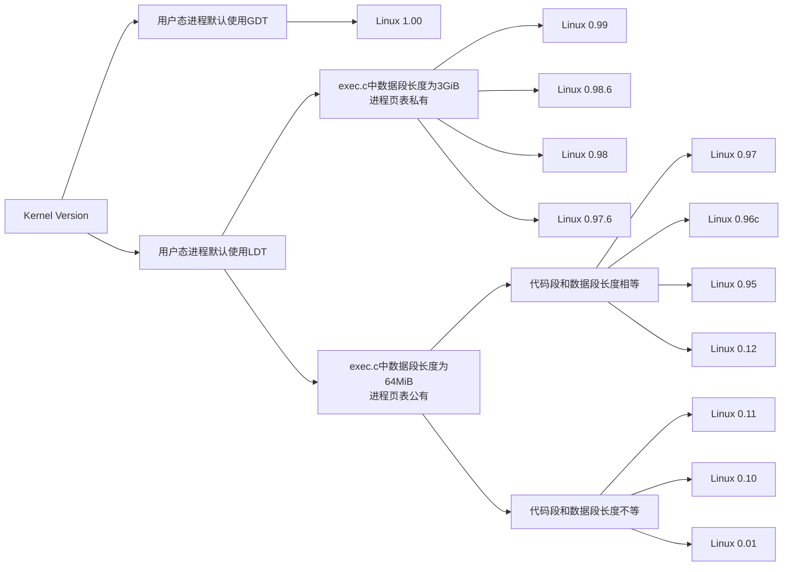

# Contents

[TOC]


|              | 例子 |
| :----------: | :--: |
|  Linux 0.01  |      |
|  Linux 0.10  |      |
|  Linux 0.11  |      |
|  Linux 0.12  |      |
|  Linux 0.95  |      |
| Linux 0.96c  |      |
|  Linux 0.97  |      |
| Linux 0.97.6 |      |
|  Linux 0.98  |      |
| Linux 0.98.6 |      |
|  Linux 0.99  |      |
|  Linux 1.00  |      |

Linux RISC-V相关的代码来自Linux 内核6.8版本

```
# Output:
# /etc
# ├── apache2
# │   ├── conf-available
# │   └── sites-enabled
# ├── apt
# │   ├── preferences.d
# │   └── sources.list.d
# ├── bluetooth
# │   └── main.conf
# ├── cron.d
# │   └── .placeholder
# ├── dbus-1
# │   └── system.d
# ├── dpkg
# │   └── origins
# └── environment
```


```latex
\text{Kernel Version}\begin{cases}

\text{用户态进程默认使用GDT}\\

\text{用户态进程默认使用LDT}\\

\end{cases}\\
```


# 文章构成


## 需要提及的部分

$$
\begin{cases}

\text{内存管理}\\
\text{Linux 0.10}\\
\text{Linux 0.01}\\

\end{cases}\\
$$


# 开头灵感

早期Linux与x86体系结构相关。

现代Linux是架构化的, 分为体系结构相关和体系结构无关。


# 零星灵感

## SBI处理

SBI能处理部分CSR, 

https://github.com/riscv-software-src/opensbi/blob/master/lib/sbi/sbi_illegal_insn.c

system_opcode_insn 处理CSR -> truly_illegal_insn  -> sbi_trap_redirect 转发会上一级

https://github.com/riscv-software-src/opensbi/blob/master/lib/sbi/sbi_trap.c


## ISA版本说明

关于80x86, IA-32, IA-32e, x86,x64, x86-64, Intel 64, AMD64, EM64T这些术语的用法。

我们依照Linux的分类方式, 以上所有术语, 无论是32位架构还是64位架构都统称为x86。本书中采用80x86和x86互为对方别名这种观点。其中, IA-32和x86-64是Linux源码中区分32位x86和64位x86的标记(linux/arch/x86/kernel中的两个文件sys_ia32.c和sys_x86_64.c), 但更多的时候, Linux只是更简单的在x86子目录中使用32和64的数字来区分。Intel手册则是用IA-32和Intel 64来区分自己产品线下的32位x86和64位x86。在x86的64位分支中中的称呼涉及到了Intel和AMD的一些有趣历史, 这里不多赘述。

总的而言本文采取的术语规范如下:
$$
\text{x86, 80x86}\begin{cases}

\text{x86-32}\begin{cases}
	\text{i386}\\
  \text{IA-32}\\
  
  \end{cases}\\
  \\

\text{x86-64}\begin{cases}
	\text{x64}\\
	\text{AMD64}\\
  \text{IA-32e}\\
  \text{Intel 64}\\
  \text{EM64T}\\
  \end{cases}\\

\end{cases}\\
$$
本文以x86-32来指代32位的x86指令集, 以x86-64来指代64位的x86指令集, x86代指所有的x86-32和x86-64指令集。


Linux 0.01~1.00期间, 主要的处理器是80386, 其中也有部分代码涉及80486处理器。无论是80386还是80486, 他们都是具体的某一种x86-32指令集。

在Linux 2.6中, x86目录下使用i386代表所有的x86-32指令集, 如今Linux x86目录下使用IA-32来代指x86-32指令集。在Intel手册中, 也使用IA-32和Intel 64来区分x86-32和x86-64指令集。在某些场合下, x86也直接与x86-64相对用于代指所有的x86-32指令集。

8086和8088是[^03]都绕不开的前辈, 他们被认为为x86-32带来了段机制。8086-family的更多细节详见[^13]手册。80286处理器也被[^03]提及, 它被认为为x86-32带来了“保护模式”, 但是24bit的它并不被Intel归于x86-32系列。80386被Intel认为是第一款x86-32处理器。

x87则是当时单独的数学协处理器芯片的代称。当时的CPU并不集成FPU, [^TBC]补充一下啥时候集成了。

IA-64是Intel曾经设计的64位处理器, 它相较x86有着较大的区别。2.6时期,合并arch下的x86-32 ( 在目录中名为i386 )和x86-64指令集的代码到x86目录下时, IA-64始终独立为一个单独的目录就可以说明这一点。在这个时候, IA-32作为IA-64的子目录存在。它里面存放着兼容x86-32的代码, 在部分文件的注释中清晰的表明“Adapted from arch/i386/...”。Linux已于6.7版本中移除了对IA-64的支持, arch目录下的IA-64在6.8中已不复存在。

# 被删掉的

## 寄存器与ABI

~~Segment registers用于处理器内存管理中的段机制.( There is no mode bit to disable segmentation. The use of paging, however, is optional.  ([^03] Vol.3A 3.1)  ) [^WBL] 后面介绍段机制~~

~~Status and instruction registers.These special-purpose registers are used to record and alter certain aspects of the 80386 processor state.~~

~~RISC-V的寄存器分为两类, 通用寄存器和CSR寄存器(contrl and status register ).~~

~~其中, 本文在此处具体讨论的是RV32I / RV64I中的通用寄存器。RISC-V的CSR为各个权级实现了及其丰富的功能, 仅使用“contrl and status”来概括掩盖了这种复杂性。本文仅在必要时介绍对应CSR寄存器, 对于他们的介绍也将会分散在本文的不同部分。~~

# Operation System

From: [^01]  P1

> Note that while the term “Linux” is often used to denote the whole system that is built up from the basic kernel and all the system and user applications that are usually running on top of the kernel, in the context of this thesis only the kernel itself is considered. The portability of system and user applications is here considered a totally different issue, even though there are obviously some common concerns.


# Memory Layout


有些问题是依旧会随着技术的发展而变化的。有些则是i386体系下绕不开的问题。


## ==x86与RISC-V与内存相关的体系结构问题==

- ==权级保护==
- ==VMA ( Virtual Memory Area )管理方式==

==介绍一下x86的段。介绍GDT、TSS的最低使用要求。==

==介绍RV的M、S、U。介绍SBI。==


## ==研究的问题==

From: [^01]  P2

> ==Linux did not even try to avoid using the x86 features available to those early versions== — quite the opposite. Linux started out as a project to find out exactly what you could do with the CPU, and as such it used just about every feature of the CPU you could find ranging from using segments for inter-process protection to hardware assisted process switching.

- ==Memory Layout (时间划分)==

  - ==Not Early Version==

    ==只存在Virtual Address和Physical Address的概念, 所利用的硬件结构能做到非恒等偏移的映射:==

    | 架构    | 映射方法                                                 |
    | ------- | -------------------------------------------------------- |
    | 80x86   | page table(段机制仅满足体系要求)                         |
    | Alpha   | page table                                               |
    | PowerPC | hash table                                               |
    | MIPS    | not have any architecture-specified page tables, BUT TLB |

    ==而段机制只能做到恒等偏移, 所以即使是早期的Linux也在使用x86段机制的基础上使用了页表机制。==

    

    ==**注意!!!**==
    
    ==在研究早期版本Linux时, 由于使用了段机制来分离用户态和内核态, 更早的内核甚至使用段机制来分离不同的进程。同时由于x86体系的术语中Virtual Address的指代在不同书籍/手册中均有不同的定义。故, 本文中所有使用Virtual Address一词都均遵循[^01]中Virtual Address的概念。==
    
    ==从现代眼光来看, 可以做两个类比。==
    
    ==Logic Address的最终计算结果相当于[^01]中Virtual Address的概念。严谨的来说, Logic Address包含了两个部分, 并不是“一个”地址, 本文中出现Logic Address一词在使用上均表示“Logic Address的最终计算结果”。==
    
    ==Linear Address相当于Programer Counter的值。==
    
    ==早期的分段机制设计导致Programer Counter和实际在整个Virtual Address寻址使用的“指针”并不相同。这也导致我们在分析早期Linux内核时, 有时需要同时从Programer Counter视角下的内存分布与Virtual Address下的内存分布。==
  
  
  
  
  
  - ==Early Version==
  
    ==Linux 1.0以及之前的版本都使用段机制来隔离内核和用户态程序。所以分析问题分两个步骤:==
  
    - ==首先分析内核和用户态程序在~~Abstract Virtual Address和PC related Address~~视角分别是如何分布的。==
      - ==段机制视角==
      - ==分页机制视角(页表的私有化问题)==
    - ==接着分析用户态和内核态空间中各子项的分布情况==。


## ==现代Linux在x86上的段机制的处理==

==简言之, 现在Linux使用段机制仅为了满足x86体系结构的要求。既不会使用段机制来隔离不同的进程, 也不使用段机制来隔离用户态与内核态。==

==这一点可以由Linux对GDT的使用看出 [^05cn] P47...==

==每个CPU对应一个GDT。其中用户代码段、用户数据段、内核代码段、内核代码段的Base都为0x0, 长度都为4GiB。==


## 不同早期版本的Linux的内存布局(段相关)

任务号以 nr 表示

仅讨论段机制造成的Abstract Virtual Address空间上的布局

|              |     内核起点      | 内核范围(长度) | 内核-注释  | 进程起点                              | 进程起点-注释 | 进程范围(长度)                                               | 进程范围-注释                                         |
| :----------: | :---------------: | -------------- | ---------- | ------------------------------------- | ------------- | ------------------------------------------------------------ | ----------------------------------------------------- |
|  Linux 0.01  |        0x0        | 8MiB 可扩展    | head.s末尾 | nr*0x400_0000                         | 64MiB         | code_limit = 参数相关<br />data_limit = 0x400_0000           | code选择子0x0f<br />data选择子0x17                    |
|  Linux 0.10  |        0x0        | 16MiB 可扩展   | head.s末尾 | nr*0x400_0000                         |               | 同上                                                         |                                                       |
|  Linux 0.11  |        0x0        | 16MiB 可扩展   | head.s末尾 | nr*0x400_0000                         |               | 同上                                                         |                                                       |
|  Linux 0.12  |        0x0        | 16MiB 可扩展   | head.s末尾 | nr*TASK_SIZE (TASK_SIZE = 0x400_0000) |               | code_limit = data_limit = TASK_SIZE                          |                                                       |
|  Linux 0.95  |        0x0        | 16MiB 可扩展   | head.s末尾 | nr*TASK_SIZE (TASK_SIZE = 0x400_0000) |               | code_limit = data_limit = TASK_SIZE                          |                                                       |
| Linux 0.96c  |        0x0        | 16MiB 可扩展   | head.s末尾 | nr*TASK_SIZE (TASK_SIZE = 0x400_0000) |               | code_limit = data_limit = TASK_SIZE                          |                                                       |
|  Linux 0.97  |        0x0        | 16MiB 可扩展   | head.s末尾 | nr*TASK_SIZE (TASK_SIZE = 0x400_0000) |               | code_limit = data_limit = TASK_SIZE                          |                                                       |
| Linux 0.97.6 | 0xc0000000 (3GiB) | 16MiB 可扩展   | head.s末尾 | 0x0                                   |               | code_limit = data_limit = TASK_SIZE<br />(TASK_SIZE = 0xC000_0000) | 3GiB                                                  |
|  Linux 0.98  | 0xc0000000 (3GiB) | 1GiB           | head.s末尾 | 0x0                                   |               | code_limit = data_limit = TASK_SIZE<br />(TASK_SIZE = 0xC000_0000) |                                                       |
| Linux 0.98.6 | 0xc0000000 (3GiB) | 1GiB           | head.s末尾 | 0x0                                   |               | code_limit = data_limit = TASK_SIZE<br />(TASK_SIZE = 0xC000_0000) |                                                       |
|  Linux 0.99  | 0xc0000000 (3GiB) | 1GiB           | head.s末尾 | 0x0                                   |               | code_limit = data_limit = TASK_SIZE<br />(TASK_SIZE = 0xC000_0000) |                                                       |
|  Linux 1.00  | 0xc0000000 (3GiB) | 1GiB           | head.s末尾 | 0x0                                   | GDT而非LDT    | code_limit = data_limit = TASK_SIZE<br />(TASK_SIZE = 0xC000_0000) | #define USER_CS    0x23 <br />#define USER_DS    0x2B |

### ==关于内核范围可扩展性:==

==Linux 0.01 ~ Linux 0.97在GDT的内核范围设计上默认为16MiB, 在页表可能冲突的层面上最大可以接受64MiB的范围。由`TASK_SIZE`所影响。Linux早期将`TASK_SIZE`设为64。(4GiB / TASK_SIZE = 64MiB ) 同时仅有一份(总)页表, 前端的内存空间只能由一级页表的前端做恒等映射。这一段虚拟地址并不能跟task1的段虚拟地址冲突。==

==Linux 0.97.6在GDT的内核范围设计上默认为16MiB, 理论上可以拥有1GiB的空间。==

==PS: 内核内存范围大小和实际物理内存的大小不能划等号。Linux 0.97.6及以前, 物理内存的大小与head.S中的页表设置和GDT设置相关。Linux 0.98中物理内存的大小与head.S中的页表设置相关。而到了Linux 0.98.6中, 物理内存大小才与head.S中的设置解耦。==

> ==在注释中提及Linus自己的电脑只有16Mb, 所以如果要做出更改, 需要(search for "16Mb")并做修改即可使用更大的内存。==

尽管从Linux 0.98.6到Linux 1.00的时间段内, 物理内存大小才与head.S中的设置解耦, 但是开发者们关注的仍然是16MiB、32MiB这种级别的物理内存大小的问题。简言之, 早期的内核远没有到3:1分配下x86架构考虑896MiB的MAXMEM问题的时候[^06]。 


### ==用户态进程起点与范围==

==Linux 1.00及之前用户态进程的起点与范围的问题, 可划分为几个阶段。==




$$
\text{Kernel Version}\begin{cases}

  \text{用户态进程默认使用GDT}\begin{cases}
  \text{Linux 1.00}\\
  \end{cases}\\
  
  \\

  \text{用户态进程默认使用LDT}\begin{cases}

    \text{使用页机制隔离不同进程}\begin{cases}
    \text{Linux 0.99}\\
    \text{Linux 0.98.6}\\
    \text{Linux 0.98}\\
    \text{Linux 0.97.6}\\
    \end{cases}\\
    
    \\

    \text{使用段机制隔离不同进程}\begin{cases}
    
      \text{代码段和数据段长度相等}\begin{cases}
      \text{Linux 0.97}\\
      \text{Linux 0.96c}\\
      \text{Linux 0.95}\\
      \text{Linux 0.12}\\
      \end{cases}\\
      
      \\
    
    	\text{代码段和数据段长度不等}\begin{cases}
      \text{Linux 0.11}\\
      \text{Linux 0.10}\\
      \text{Linux 0.01}\\
      \end{cases}\\

    \end{cases}\\


  \end{cases}\\

\end{cases}\\
$$


==Linux 1.00开始用户态进程代码段和数据段默认开始使用GDT选择子, 而非之前版本所使用的LDT选择子。这体现在用户态进程(实际)使用的段选择子上。( `INIT_TASK`宏中装在的段选择子并不是最后实际使用的段选择子, 这点体现在``move_to_user_mode()``宏中 ) ( Linux 1.00中存在很多与LDT相关的代码, 这点我们在后面在做说明 )==

==在默认使用LDT作为用户态选择子的版本中, 用户态进程起点与范围集中体现在 `INIT_TASK`宏、fork系统调用和exec系统调用的相关代码上。==

==在这其中, 有三项等价的特征可以用于划分。分别是: 以用户态进程的起点是否与nr无关为划分、以用户态是否拥有3GiB的段长度为划分、以用户态拥是否拥有私有的(总)页表(即页表目录)为划分。这一变化出现在Linux 0.97与Linux0.97.6之间。在Linux 0.97.6及之后的版本, 用户态的段机制便都以0x0为起点, 段长为3GiB, 也因此每个进程都需要自己的私有页表。在Linux 0.97及之前的版本中, 段起点与nr号相关, nr*0x400_0000。(nr为)0号进程的段长为640KiB, 所有fork于它的子进程的段长在由exec系统调用更改前均继承于(nr为)0号进程的长度。而在执行exec时则将代码段和数据段设置成对应的长度。==

==而exec中为修改的新段limit中, 可以从code_limit和data_limit是否相等来做进一步细节上的区分: 0.01~0.97中数据段的长度都为64MiB, 而代码段的长度设置上却有些区别。0.01、0.10和0.11中, 代码段的长度来由`change_ldt` 函数中的 `text_size`参数决定; 在此之后(直至0.99), 都是直接在`change_ldt`中令code_limit = data_limit = TASK_SIZE(只是TASK_SIZE宏的数值有区别, 如同前文所述, 0.97及之前为64MiB, 0.97.6及之后为3GiB)。(此期间`change_ldt` 函数保留了 `text_size`参数, 但是实际上并未在函数内使用这个参数)==

==PS: `change_ldt`存在于我们所列出的所有早期版本中。但是在Linux 1.00彻底脱离了重设用户态进程LDT的用途。(因为Linux 1.00使用GDT为用户态所用) (且Linux 1.00中 `change_ldt` 与`sys_modify_ldt`的实现无关)==


### ==用户态进程起点与范围代码解释==

```
# Linux 0.01 ~ Linux 0.99 中研究用户态进程起点与范围的主要相关函数/宏名

1、只列出了主要相关函数/宏的函数/宏名
2、函数/宏的参数可能在各个版本中有变化

sys_fork
	└── copy_process
				└── copy_mem
							└── set_base
							
sys_execve
	└── do_execve
				└── change_ldt
							├── set_base
							└── set_limit
```

==Linux0.01 ~ 0.99的init_task的段限长都是640KiB。==

==首先要说明的是`set_base`和`set_limit`都只更改对应表项的对应部分。例如, 在`copy_mem`中调用`set_base`时, 对应表项的原limit属性并没有改变。==

- ==Linux 0.01、0.10、0.11==

  ==在`copy_mem`中调用`set_base`宏设置fork出的子进程的base为`nr * 0x4000000` ( 64MiB )。==

  ==在`change_ldt`中依据传入的`text_size`参数用`set_limit`宏设置代码段限长, 并将数据段长度设为`0x4000000` ( 64MiB )。虽然调用了`set_base`但是实际没有改变当前进程的base参数。==

- ==Linux 0.12、0.95、0.96c、0.97==

  ==引入了`TASK_SIZE`宏, 此时的`TASK_SIZE`宏为`0x4000000` ( 64MiB )。==

  ==在`copy_mem`中调用`set_base`设置fork出的子进程的base为`nr * TASK_SIZE`。( 仅引入了宏, 本质与Linux 0.01、0.10、0.11没有区别 )==

  ==在`change_ldt`函数保留了`text_size`参数, 但未在函数体内使用。使用`set_limit`宏同时设置代码段限长和数据段限长为`TASK_SIZE`。虽然调用了`set_base`但是实际没有改变当前进程的base参数。==

- ==Linux 0.97.6、0.98、0.98.6、0.99==

  ==此时的`TASK_SIZE`宏为`0xC0000000` ( 3GiB )。==

  ==在`copy_mem`中调用`set_base`设置fork出的子进程的base为0。==

  ==在`change_ldt`函数保留了`text_size`参数, 但未在函数体内使用。使用`set_limit`宏同时设置代码段限长和数据段限长为`TASK_SIZE`。虽然调用了`set_base`但是实际没有改变当前进程的base参数。==
  
- ==Linux 1.00==

  ==Linux 1.00使用了GDT中的表项作为自己的段描述符, 其数据段和代码段限长应该都是3GiB。尽管在Linux 1.00的`INIT_TASK`前的注释中写道`Base=0, limit=0x1fffff (=2MB)`, 但是从具体使用的段选择子来看, init_task数据段和代码段限长应为3GiB。==


### ==Linux 1.00中LDT相关的解释==

==Linux 1.00中, 依旧保有LDT结构、进程struct拥有LDT属性( 面向对象编程的属性的概念 )、进程私有的LDT可以在fork时被子进程继承, 有修改LDT的系统调用。但与Linux 1.00之前版本中, fork继承/部分继承父亲进程的LDT ( 0.97及之前的版本只继承limit部分, base字段与nr号相关不继承 ), exec中更改LDT的行为不同。Linux 1.00中fork继承父进程的LDT, 但是在exec时会恢复为默认LDT。==

==默认情况下, Linux 1.00中所有进程私有的LDT表项都指向`&default_ldt`, 只有在首次调用`sys_modify_ldt`的`write_ldt`操作时, 会分配一个新的空间来存放一个新的LDT表。( 注: 子进程fork拥有非默认LDT的父进程时, 对LDT的复制采取的是重新分配空间的深拷贝 )==

==在这一点上, Linux 1.00已经与后期版本有异曲同工之妙[^05cn] P50。==


## ==不同早期版本的Linux的内存布局(页相关)==

==严格的使用x86的术语来说, 整个分页机制分为页表目录、页表、页内偏移三个部分, 被视为一个2级页表。==

==在[^01] P28中引入了kernel virtual page tables的概念。并使用了三级的页表, 分别为Page Directory、Mid Page Table、Page Table、 Offset in Page  ( [^01] P27 )。如果实际的硬件体系结构的页表级数少于3级, 则会通过机制隐藏其中的一级。==

==Linux 2.6中, 内核使用的虚拟页表是一个4级页表[^06] P124~P125。==

==Linux 4.11时, 页表被扩展为5级[^07] P219。==

==正如[^01] P28中所说:==

> ==As three levels is enough to map on the order of 40–45 bits of virtual address space, and no current hardware supports more, that was the choice for the Linux kernel virtual machine.==

==每一个级数的设计在当时的眼光看都是足够的。但从级数的不断增长来看, 似乎随着技术的发展, 一切都不会**足够**。==

==本文在叙述时并未为每一级页表命名, 只是简单的至顶而下成为第?级目录。==


#### ==现代Linux分页机制==

==现代Linux采用了kernel virtual page tables的概念。==

==这个概念在[^01] 中被提及时, 使用了三级的页表结构。分别为Page Directory、Mid Page Table、Page Table、 Offset in Page  ( [^01] P27 )。如果实际的硬件体系结构的页表级数少于3级, 则会通过机制隐藏其中的一级。==

==在当时看来3级的kernel virtual page tables是足够的, 正如[^01] P28中所说:==

> ==As three levels is enough to map on the order of 40–45 bits of virtual address space, and no current hardware supports more, that was the choice for the Linux kernel virtual machine.==

==在Linux 2.6中, 内核使用的虚拟页表是一个4级页表[^06] P124~P125。==

==在Linux 4.11时, 页表被扩展为5级[^07] P219。==

==每一个级数的设计在当时的眼光看都是足够的。但从级数的不断增长来看, 似乎随着技术的发展, 一切都不会**足够**。==


### ==用户态进程与(总)页表的关系==

==用户态进程与(总)页表的关系主要通过`invalidate()`宏和fork中的系统调用中的`copy_page_tables`体现。==

```
1、只列出了主要相关函数/宏的函数/宏名
2、函数/宏的参数可能在各个版本中有变化

# Linux 0.01 ~ 0.97 中刷新页表的宏

#define invalidate() \
__asm__("movl %%eax,%%cr3"::"a" (0))

# Linux 0.97.6 ~ 1.00 中刷新页表的宏

#define invalidate() \
__asm__ __volatile__("movl %%cr3,%%eax\n\tmovl %%eax,%%cr3": : :"ax")


# Linux 0.01 ~ Linux 0.99 中研究(总)页表的关系的主要相关函数/宏名
sys_fork
	└── copy_process
				└── copy_mem
							└── copy_page_tables
							
							
# Linux 1.00 中研究(总)页表的关系的主要相关函数/宏名
sys_fork
	└── copy_vm
				├── clone_page_tables
				└── copy_page_tables
```

==页表的使用因是否使用段机制分离用户态进程而划分。==

==Linux 0.01~0.97使用段机制分隔不同进程, 整个Linux内核与进程公用一份一级页表。此时`invalidate()`宏仅是将0重新写入CR3寄存器来完成页表的刷新(一级位于0x0处)。`copy_page_tables`本质上是对二级页表的复制。==

==Linux 0.97.6~1.00使用页表来隔离不同的进程, 设计上一个进程私有一份一级页表。此时`invalidate()`宏会通过将CR3读出再写入的方式完成对页表的刷新。`copy_page_tables`会为每个进程的一级页表和二级页表重新分配空间, 完成页表的深拷贝。==

==在使用页表来隔离不同的进程的版本中, Linux 1.00又是一个特例。它不仅提供了`copy_page_tables`还提供了`clone_page_tables`这个函数。`clone_page_tables`仅将子进程的一级页表指向父进程的一级页表, 并未重新分配空间。==

==子进程的页表是父进程页表的一份引用。此时内核对于“进程”的描述还停留在process (例: `copy_process`)与task一词。如果从现代角度回看, 我们不难看出其行为与“线程”的关系。尽管此时的clone机制仍是相当简陋的。==


## 内存各部分的成分构成

$$
\text{内存构成}\begin{cases}

\text{物理内存}\begin{cases}
\text{x86}\\
\text{RV}\\
\end{cases}\\
\\

\text{虚拟内存}\begin{cases}
\text{内核和用户如何划分}\\

\text{内核态}\begin{cases}
\text{古早}\\
\text{现代}\\
\end{cases}\\
\\

\text{用户态}\\
\end{cases}\\

\end{cases}\\
$$


### ==x86的物理内存==

==处于兼容性考虑, 物理地址0x000a0000到0x000FFFFF (640KiB~1MiB)处留给BIOS以及一些图形卡[^05cn]P71。==

==Linux 0.01~ Linux 0.99中, 内核实际被放置在物理地址0x0~640KiB区间中。==

==Linux 1.00中内核如果不使用压缩启动模式, 内核将被加载到0x00001000处。使用compressed boot则会被放置到0x00101000处。(见head.S)==

==这是因为Linux 0.01 ~ Linux 1.00的一级页表(Linux 0.01 ~ 0.97为全局一级页表`_pg_dir`, Linux 0.97.6 ~ 1.00为临时一级页表`_swapper_pg_dir`)都是紧挨内核头部放置的, 内核最前端代码将在执行完后被页表数据覆盖。Linux为了保证内核的NULL异常也能被捕获, 所以让第一个页不存在。==

> ==.org加载的位置是LD时推断的位置, 与entry入口的位置无关。==
>
> ==如果一段代码在链接的时候用了 -Ttext 1000 参数, 然后这段实际被加载到了0x00101000。==
> ==紧跟在.org 0x1000汇编后的符号会被加载到0x00101000。因为这个符号认为自己处在0x1000 ( 也就是与指定的入口是同一个位置 )。因为加载时整体偏移了0x00100000, 所以实际位于0x00101000。==

==由于Linux 1.00的代码本身还是以0x1000为起点, 本文中我们仅在这一篇章提及这1MiB的偏移。==

==Linux 2.6中, 内核被加载到了物理地址的0x00100000处。此时不再需要保留0x1000( 第一个页 )来捕获内核访问NULL指针的异常。此时系统的内核态和用户态用页表权限的方式分离, 保留0x0开始的第一个页的工作留给了用户态的内存布局来实现。==


### ==RISC-V的物理内存==

==当下RV会把M-mode的runtime, 即SBI放在物理的内存开头处。Linux RV的启动手册要求内核被放置在与PMD (Page Middle Directory, 页中间目录)的边界上(rv64就是2MiB, rv32是4MiB)。当下SBI runtime的大小往往远小于2MiB。Linux内核代码( head.S )则更直接, 如果是rv64就偏移2MiB, 如果是rv32就偏移4MiB ( PS: 在M-mode下内核不偏移 )。==

==另外, 使用SBI的话, a1有可能包含设备树在内存中的位置( 之后补充严谨 )。==

### 我的设计

PA起点( DDR的起点 )映射到  0xffff........ffff << ( VA_BIT - 1 )处

不修正SBI的偏移( 为了只用一张Sv39的页表做2GiB的映射, trampoline_pg_dir )

只保证2GiB的对齐。

移植没有ioremap的时候, 直接让RV的MMUIO也使用同样的OFFSET ( VA - PA )

# 异常与中断处理( 基本机制 )


## 现代RV Linux的切换栈机制

```python
tp, sscratch = sscratch, tp

if tp == 0:
  tp = sscratch
  store(sp, tp.kernel_sp)
  
  
store(sp, tp.user_sp)
load(sp, tp.kernel_sp)
sp -= PT_SIZE_ON_STACK
save(ra, gp, t0)
save(REST_Generous_Register)

```


# RV Linux启动


# ==CPU编号==

hartid与Linux内部cpuid有一组映射关系。

CPUID 到 HARTID 的映射由`cpuid_to_hartid_map()`提供。HARTID 到 CPUID 的映射由`riscv_hartid_to_cpuid();`提供。

他们的核心是`__cpuid_to_hartid_map`数组 (在https://github.com/torvalds/linux/blob/master/arch/riscv/include/asm/smp.h中)。

```c
/*
 * Mapping between linux logical cpu index and hartid.
 */
extern unsigned long __cpuid_to_hartid_map[NR_CPUS];
#define cpuid_to_hartid_map(cpu)    __cpuid_to_hartid_map[cpu]
```

它在https://github.com/torvalds/linux/blob/master/arch/riscv/kernel/smp.c被初始化为全-1。

```c
unsigned long __cpuid_to_hartid_map[NR_CPUS] __ro_after_init = {
	[0 ... NR_CPUS-1] = INVALID_HARTID
};
```

其中有一对使用`static inline`声明的函数, 他们用于单核的情况。其中`boot_cpu_hartid`在启动时被设置(head.S ), 它也是启动所使用的hart的hartid。任何CPUID都会映射到`boot_cpu_hartid`  (在https://github.com/torvalds/linux/blob/master/arch/riscv/include/asm/smp.h中)。

```c
static inline int riscv_hartid_to_cpuid(unsigned long hartid)
{
	if (hartid == boot_cpu_hartid)
		return 0;

	return -1;
}
static inline unsigned long cpuid_to_hartid_map(int cpu)
{
	return boot_cpu_hartid;
}
```

多核的情况下: (https://github.com/torvalds/linux/blob/master/arch/riscv/kernel/smp.c)

```c
void __init smp_setup_processor_id(void)
{
	cpuid_to_hartid_map(0) = boot_cpu_hartid;
}

int riscv_hartid_to_cpuid(unsigned long hartid)
{
	int i;

	for (i = 0; i < NR_CPUS; i++)
		if (cpuid_to_hartid_map(i) == hartid)
			return i;

	return -ENOENT;
}
```

另一个函数在上方的宏中:

```c
#define cpuid_to_hartid_map(cpu)    __cpuid_to_hartid_map[cpu]
```


# 设计灵感

## Linux 0.01移植

直接移植	OldLinuxRV 0.01

加上协处理器 OldLinuxRV 0.02

然后移植SMP版本	OldLinuxRV 0.03


中断/异常/系统调用的进入与退出	为一节

进程的切换	另一节

注意软件的版权信息


# 1  Introduction

- 本文是什么
  - 操作系统是什么
  - 内核 + 部分软件
- 内核
  - 硬件侧和软件侧
  - 硬件侧分为 CPU subsystem (including memory management, caches and optionally multiprocessing details) and the architecture of the I/O interfaces
  - 软件侧 子集 + 符合现代体系

This paper is an introduction to '以Linux 1.0为蓝本的在RISC-V 上运行的操作系统', OldLinuxRV.

~~There is no completely adequate definition of *operating system*. A more common definition, and the one that I follow in this paper, is that the *operating system* can be equated to the *kernel*[^02]. Another viewpoint is that the definition of operating system should not be limited to the term *kernel*. It should also include system programs along with the kernel. If the latter definition is adopted, then defining what is a system program itself will become the next difficult problem, because the boundaries between system programs and application programs are blurred. This paper will focus on implementing the kernel. In addition, some system programs and application programs, which are not the focus of this paper, will also be implemented to demonstrate the various functions of this operating system, OldLinuxRV.~~

~~Linus Torvalds pointed out that *the kernel itself is defined by both the hardware it runs on and the software it supports*[^01]. 从硬件侧定义OldLinuxRV, 最鲜明的特点在于它运行在RISC-V体系结构的一个子集上面。从软件侧来讲, 它会去兼容Linux1.0阶段~~

- *Hence, we often use the term "operating system" as a synonym for "kernel".* [^05] P8
- *用户见面是操作系统的外在表象, 内核才是操作系统的内在核心。*[^06cn] P4


RISC-V Architecture 作为一种新兴的体系结构, ...。虽然已经发展了几年, 当下RISC-V architecture仍处于发展的初期。仍有许多标准处于crafting的状态, 如, crafting中的CLIC被用于补足曾经被设计用于处理外设中断的PLIC。

但尽管如此, 得益于


## 1.1 ???	

Linus先生是这样描述操作系统内核的: *"As such, the kernel itself is defined by both the hardware it runs on and the software it supports."*。


# 2 Basic Kernel Framework

​	Linus先生是这样描述操作系统内核的: *"As such, the kernel itself is defined by both the hardware it runs on and the software it supports."*。

*"Memory is one of the most fundamental resources ~~in the system~~"* of a computer.如何分配内存(memory management问题)是及其重要的, 但是在这之前, 必须先确定一个明确的Memory Layout. 在使用virtual memory机制的体系结构上, Memory Layout问题本质上就是提出一个合理的physical memory 到virtual memory的mapping scheme.

​	

​	

Memory Layout 问题在RISC-V体系架构上 [^01]

## 2.1 Memory Layout

​	Memory Layout问题本质上就是提出一个合理的physical memory 到virtual memory的mapping scheme.

​	显然, 我们需要研究的子问题自然是virtual memory和physical memory的使用情况。其中virtual memory的使用情况是研究内核程序和用户态进程程序在virtual address space([^01] 4.1.1 指的是抽象的)中的布局情况。physical memory则是研究内核究竟如何管理和使用physical address space。

​	此处的virtual address和virtual memory

​	此处的virtual address和physical address都是研究内存问题时的抽象概念。virtual address是 一种CPU 理论上能合法寻址的能力。而physical address则是*Used to address memory cells in memory chips* ([^05] P36). 而如何实现他们之间的映射的细节, 我们在这个视角层面上并不关心。


### 2.1.1 kernel and user in virtual address space

​	请注意virtual address space和virtual address的区别。virtual address的一词在本文中的定义是由页表

内存布局问题是研究内核程序和用户态进程程序在内存地址空间中如何布局的问题。

为了避免歧义, 需要特别说明此处“内存地址空间”和“程序”两个术语。

此处“内存地址空间”是指某体系结构下, 理论上能合法寻址的一个寻址空间。例如在80x86体系结构的保护模式中, 合理利用段机制和分页机制, 逻辑地址理论上能获得0~4GiB的寻址能力。而在x64体系结构的IA-32e模式下, 线性地址的位宽的64位中低48位用于线性地址寻址、高16位为符号扩展, 理论上的合法寻址范围是0x00000000,00000000~0x00007FFF,FFFFFFFF和0x00008000,00000000~0x FFFFFFFF,FFFFFFFF。

- 此处讨论的Memory Layout

- 内存布局问题简单而言就是kernel和进程分别从内存的何处开始, 何处结束的问题。

### 内存有关术语名称问题

- 页表名称问题。Linux0.01 - Linux-1.00中, 分别使用了“页表目录”和“页表”的概念。本文则不做此区分, 只区分页表的级数。例如x86的“页表目录”本文成为“一级页表”, 而x86的“页表”本文称为“二级页表”。本文中“页表”指的是由所有级数的页表组成的、用于虚拟内存转换到物理内存的整体结构。

- 关于i386的内存相关术语有些混乱, 分别是线性地址、逻辑地址、虚拟地址、物理地址。我们依据[^03] (Volume 3 3.1)的表述segmentation and paging。其中, 由segmentation机制联系着线性地址、逻辑地址两个概; 将最终用由paging机制联系着虚拟地址和物理地址。线性地址被看作是段内偏移(offset), 其寻址空间是理论最大内存空间的子集。仅当处于Protected Flat Model([^03] 3.2.2)时, 其寻址空间和逻辑内存相同, 即整个理论最大内存空间。因此, 如果本文提及i386的“地址”这一概念, 其指的是由逻辑地址计算出的在整个内存空间中的地址。i386的“地址”再由是否开启页表分为虚拟地址和物理地址。

  (并不采用[^04]6.2.1中的说法, 即*虚拟地址(VirtualAddress)是抽象地址的统称，它们大多不能独立转换为物理地址，像逻辑地址、有效地址、线性地址和平坦地址皆属于虚拟地址的管理范畴*。 )

- i386相较RISC-V而言, 多了segmentation机制。

  - 从整个内存空间or内存物理取址 => logic
  - 编译器角度or程序执行角度or PC(Program Counter) 角度 => Linear

- 

### 内存模型区别

"段式存储器模型"的英文术语是 "Segmented Memory Model"，而"分页式存储器模型"的英文术语是 "Paged Memory Model"。


## ==分段是必须的==

==[^03] Volume3 3.1==


sched_init() in sched.c


```
set_ldt_desc
#define _LDT(n)
#define TASK_SIZE
```


```C
// Linux 1.00
// In sys_fork
// 第一次对p->ldt检测, 实际检测的是父ldt
if 父ldt != NULL:
	分配空间
  if 分配成功:
			拷贝
  else:
			失败留到稍后处理

...
if p->ldt != NULL: // 之前分配成功
	设置
else:
	设置默认的ldt

```


# Reference

[^01]: Linux a Portable Operating System
[^02]: [Operating.System.Concepts(9th,2012.12)].Abraham.Silberschatz.文字版
[^03]: Intel® 64 and IA-32 Architectures Software Developer’s Manual Combined Volumes: 1, 2A, 2B, 2C, 2D, 3A, 3B, 3C, 3D, and 4
[^04]: 一个64位操作系统的设计与实现
[^05]: 深入理解Linux内核第三版(英文版)
[^05cn]: Linux内核设计与实现(原书第三版)(中文版)
[^06]: 深入Linux内核架构

[^07]: Linux内核深度解析_ARM64
[^08]: Linux内核完全注释 5.0
[^09]: RV特权级手册

[^10]: i386手册
[^11]: The RISC-V Reader: An Open Architecture Atlas  (RISC-V简明手册的英文版, 正式中文出版物是《RISC-V开放架构设计之道》)
[^11cn]: RISC-V开放架构设计之道
[^12]: 汇编程序设计与计算机体系结构 软件工程师教程
[^13]: 8086手册
[^14]: RISC-V汇编手册 https://github.com/riscv/riscv-asm-manual
[^15]: RV非特权级手册

[^16] intel有关x86S的宣传 https://www.intel.com/content/www/us/en/developer/articles/technical/envisioning-future-simplified-architecture.html

[^17]: RISC-V  SBI手册

[^18]: RISC-V Kernel Boot Requirements and Constraints https://github.com/torvalds/linux/blob/master/Documentation/arch/riscv/boot.rst


[^TBC]: 待补充对应资料/出处
[^WBL]: Will be Linked, 与文章其他部分可能相关联

[^TBF]: To be filled, 待填充内容
